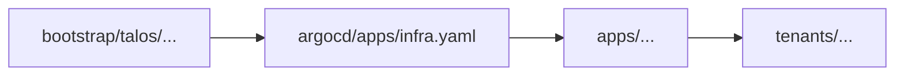

# Bootstrap

## Prerequisites

- `omnictl` CLI installed. Installation instructions can be found [here](https://docs.siderolabs.com/omni/getting-started/install-and-configure-omnictl#install-and-configure-omnictl).
- `talosctl` CLI installed. Installation instructions can be found [here](https://docs.siderolabs.com/omni/getting-started/how-to-install-talosctl#install-talosctl).
- `kubectl` CLI installed. Installation instructions can be found [here](https://kubernetes.io/docs/tasks/tools/install-kubectl/).
- Access to a vCenter environment with sufficient resources to host the Talos cluster.
- A Radboudumc Omni account. Sign up [here](https://radboudumc.eu-central-1.omni.siderolabs.io/).

## Infrastructure Setup

1. Visit our [Omni dashboard](https://radboudumc.eu-central-1.omni.siderolabs.io/clusters) to generate an installation medium (ISO or OVA).
2. Upload installation medium to vCenter.
3. Create new VM's (3 control plane nodes, 2+ worker nodes) using the uploaded installation medium.
4. Power on the VM's and wait for Talos to install and configure the cluster.
5. Process with either [Omni Setup (manual steps)](#omni-setup-manual-steps) or automate with [CLI](#omni-setup-cli).

## Omni Setup (manual steps)

1. After a few minutes. The VM's should appear in the Omni dashboard under "Machines".
2. Create a new Machine Class by visiting Machine Management > Classes > Create Machine Class.
3. (Optional) Create additional Machine Classes for worker nodes with different specifications.
4. Now go to Clusters > Create Cluster.
5. Fill in the cluster name and pick the correct Talos- and Kubernetes versions.
6. Tick the 'Use Embedded Discovery Services' checkbox.
7. Select the previously created Machine Class(es) and add the control plane and worker nodes.

## Omni Setup (CLI)

1. Download your `omniconfig` file from the Omni dashboard. (Homepage on the right)
2. In your terminal:

   ```shell
   $ cd ./bootstrap/talos/
   $ omnictl cluster template sync --file ./cluster-template.yaml
   ```


## Kubernetes Cluster Setup

1. Install ArgoCD to this repository.
2. Apply

      ```shell
      kubectl apply -n argocd -f argocd/projects/tenants-project.yaml
      kubectl apply -n argocd -f argocd/apps/infra.yaml
      kubectl apply -n argocd -f argocd/apps/tenants-appset.yaml
      ```

3. ArgoCD will then deploy the infrastructure components defined in `apps/` folder.

## Flow


